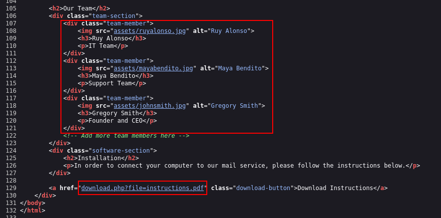
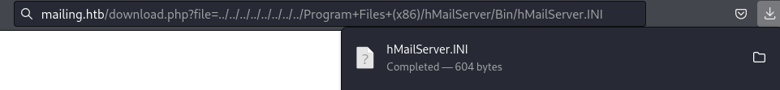
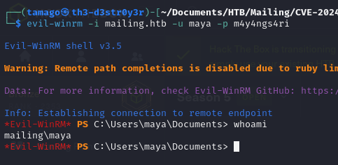
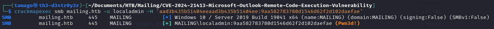

+++
author = true
title = "DevVortex HTB Writeup"
date = "2023-12-01"
description = "Devvortex writeup"
tags = [
    "ctf",
    "devvortex"
]
categories = [
    "themes",
    "hacking"
]
toc = true
image = "images/htb-mailing-box.png"
+++

## HTB - Mailing

Like always we start with rustscan to quickly check for open port and use nmap to run detail scan.

We have 19 open ports

Webserver - 80
SMTP - 25,465,587
POP3 - 110
SMB - 445
Windows - 135,139
Imap - 143, 993
WinRM - 5985

Other - Windows RPC

We know we are dealing with **Windows Machine** here.

Let's try get into the **webserver (Port 80)** first and see what's inside. But first we have to put into our **/etc/hosts** so that our DNS can resolve.

We can now enter the webpage. Now before we start poking around, let's try run our directory enumeration tools.

<figure>

<figcaption aria-hidden="true">htb-mailing-homepage.png</figcaption>
</figure>

I use **Dirsearch** and **GoBuster**. Let it run on the background first while we explore the website.

Looking into the page. We know it's about **mail server** as we saw on our nmap result. We know it's using **hMailServer**.

<figure>

<figcaption aria-hidden="true">htb-mailing-homepage1.png</figcaption>
</figure>

Clicking the link bring us to the hMailServer webpage. Nothing interesting at the moment

<figure>

<figcaption aria-hidden="true">htb-mailing-hmailserver.png</figcaption>
</figure>

On the installation part. We see "**Download Instructions**". Interestingly we can see the link. We might come back later on this.

<figure>

<figcaption
aria-hidden="true">htb-mailing-downloadinstructions.png</figcaption>
</figure>

Looking into the downloaded file. It tell us how to connect to **mailing.htb** mail server.

<figure>

<figcaption
aria-hidden="true">htb-mailing-documentation.png</figcaption>
</figure>

Reading the file, we saw 2 user. user@mailing.htb and maya@mailing.htb. Maybe we might have to use them. Let's keep em.

<figure>

<figcaption aria-hidden="true">htb-mailing-mayamail.png</figcaption>
</figure>

After gathered some information about the target. We try looking around for public exploit. We found a **hMailServer exploit** on exploit-db. We aren't sure if it's going to work, since we don't know the version of the hMAilServer.

<figure>

<figcaption aria-hidden="true">htb-mailing-hmailexploit.png</figcaption>
</figure>

Reading the exploit, we know that the **hMailServer** is vulnerable to LFI. And if we can find **hMailServer.INI** we might get the **Administrator Password**. So we have to find attack vector.

<figure>

<figcaption
aria-hidden="true">htb-mailing-hmailexploit1.png</figcaption>
</figure>

Getting back to our dirsearch and gobuster. We didn't found much.

<figure>

<figcaption aria-hidden="true">htb-mailing-dirsearch1.png</figcaption>
</figure>

We check the page source for the page and found 3 more user. And also link to the download instructions.

<figure>

<figcaption aria-hidden="true">htb-mailing-sourcepage.png</figcaption>
</figure>

I try some LFI payload on the file parameter. But then I realized we're dealing with Windows.

<figure>

<figcaption aria-hidden="true">htb-mailing-downloadlink.png</figcaption>
</figure>

Checking the downloaded instructions again. We can try getting the **/etc/hosts** file.

<figure>

<figcaption aria-hidden="true">htb-mailing-hostlfi.png</figcaption>
</figure>

And gladly enough, we managed to get the **hosts file**. Now we have found an attack vector. Let's try getting the **hMailServer.INI**.

After much trying and poking around the directory. We managed to download the hMailServer.INI.

<figure>

<figcaption
aria-hidden="true">htb-mailing-hmailserverini.png</figcaption>
</figure>

And inside there is **Administrator username and password** Hash. Let's try cracking the password using **hashcat**.

<figure>

<figcaption
aria-hidden="true">htb-mailing-hmailserverfile.png</figcaption>
</figure>

We know it's MD5.

<figure>

<figcaption
aria-hidden="true">htb-mailing-hashidentifier.png</figcaption>
</figure>

Using hashcat with rockyou wordlists.

<figure>

<figcaption aria-hidden="true">htb-mailing-hashcatadmin.png</figcaption>
</figure>

We managed to crack the password !

<figure>

<figcaption aria-hidden="true">htb-mailing-crackedadmin.png</figcaption>
</figure>

With found credential I try poking around the other Mail Server. But I just can't seem to find a way to access the email.

We know it's using Microsoft Outlook based on the Documentation that we downloaded. So I try looking for any **exploit on Microsoft Outlook**. And we found one. And it's recent.

<figure>

<figcaption
aria-hidden="true">htb-mailing-outlookexploit.png</figcaption>
</figure>

We can try using the exploit below. Basically there's a **0-Click exploit** that we can send and if the user open the email without even clicking the link. We can capture the **NTLM hashes** via **Responder**. Let's try it out.

<figure>

<figcaption
aria-hidden="true">htb-mailing-cve2024-21413.png</figcaption>
</figure>

I try using other port but **port 587** works and we can send email successfully. I'm using maya@mailing.htb based on the documentation. But I just can't seem to get any respond on my responder.

<figure>

<figcaption
aria-hidden="true">htb-mailing-exploitoutlook.png</figcaption>
</figure>

After trying and trying. I try spamming the exploit multiple times in a row. And finally our Responder managed to capture the NTLMv2 hashes.

Now we can try cracking the password using hashcat.

<figure>

<figcaption aria-hidden="true">htb-mailing-crackmaya.png</figcaption>
</figure>

And we found maya password !

We know from nmap that **port 5985** is open. So we can probably **WinRM** into the machine. We can make sure by using **CrackMapExec**.

<figure>

<figcaption aria-hidden="true">htb-mailing-winrmmaya.png</figcaption>
</figure>

We can use **evil-winrm** to access the machine using the founded credential.

<figure>

<figcaption
aria-hidden="true">htb-mailing-evilwinrmmaya.png</figcaption>
</figure>

Checking the **localgroup**, we know it's using spanish(?) language.

<figure>

<figcaption aria-hidden="true">htb-mailing-mayagroup.png</figcaption>
</figure>

Information about user Maya. We don't have much privilege here. We have to find way to escalate our privileges.

Users that's inside this machines.

<figure>

<figcaption aria-hidden="true">htb-mailing-netuser.png</figcaption>
</figure>

Let's get the user flag first on maya Desktop.

<figure>

<figcaption aria-hidden="true">htb-mailing-userflag.png</figcaption>
</figure>

I tried uploading **winPEAS** to help enumerate for us. But looks like there's **antivirus** on this machine.

<figure>

<figcaption aria-hidden="true">htb-mailing-winpeas.png</figcaption>
</figure>

I also tried uploading **meterpreter** payload but same result.

Looks like we have to manually enumerate this machine.

As we expected the **localadmin** directory is required administrator privilege.

On the root directory. We found an unusual file **"Important Documents"**. But it's empty. Suspicious. But let's move on for now.

<figure>

<figcaption
aria-hidden="true">htb-mailing-rootdirectory.png</figcaption>
</figure>

After tirelessly poking around the machine. We found a **LibreOffice version 7.4** installed in this machine.

Quick googling and we found couple of exploit regarding this version of LibreOffice. We will go with **elweth-sec/CVE-2023-2255**.

<figure>

<figcaption
aria-hidden="true">htb-mailing-libreofficeexploit.png</figcaption>
</figure>

This exploit script exploits CVE-2023-2255 by injecting a command into an ODT file. It takes in a command and output filename via command-line arguments, then modifies the content of a sample ODT file with the provided command. After rewriting the modified content into a new ODT file, it cleans up temporary files and directories. Essentially, it automates the process of injecting potentially malicious commands into ODT files, targeting systems vulnerable to CVE-2023-2255.

<figure>

<figcaption
aria-hidden="true">htb-mailing-cve-2023-2255.png</figcaption>
</figure>

We try using the exploit and make it execute command to **add the user** we have access to which is maya, into **localgroup Administrator**(Administradores since it's using spanish.)

<figure>

<figcaption
aria-hidden="true">htb-mailing-explotlibreoffice.png</figcaption>
</figure>

All we need to do now is download the file and put it into **"Important Documents"** directory.

<figure>

<figcaption
aria-hidden="true">htb-mailing-explotdownloaded.png</figcaption>
</figure>

After waiting for awhile. Maya is in Administrator group ! We can access localadmin directory now. But let's take it a step further and get actual access to localadmin.

<figure>

<figcaption aria-hidden="true">htb-mailing-mayaadmin.png</figcaption>
</figure>

We use **CrackMapExec** to ease our process on **dumping SAM Hashes**.

Since we have the hashes. We can directly use the hashes to authenticate us into the machine. Checking the SMB it's show **Pwn3d!**. Meaning we can try use **wmiexec** or **smbexec** to get access.

<figure>

<figcaption
aria-hidden="true">htb-mailing-smblocaladmin.png</figcaption>
</figure>

I use **Impacket-Wmiexec** and voila we are now localadmin and all we have to do is grab the root flag in localadmin desktop.

